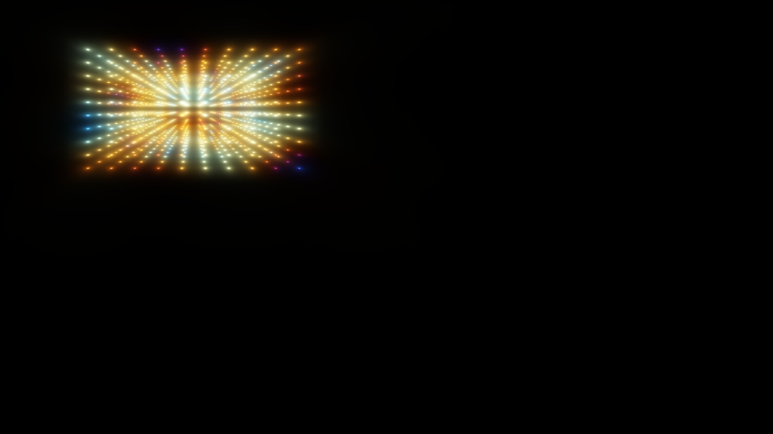

# Raymarching на Java

Реализация GLSL шейдера на Java с генерацией PPM изображений.

## Результаты

### Статичный рендер (time=0)


## Структура проекта
src/
├── Vec2.java # 2D вектор
├── Vec3.java # 3D вектор
├── Vec4.java # 4D вектор
├── Mat2.java # Матрица 2x2
├── RaymarchingRenderer.java # Рендерер
└── App.java # Главный класс
ppm/ # Сгенерированные PPM файлы
├── output_00.ppm
├── output_01.ppm
└── ...


## Запуск

```bash
javac *.java
java App
```

## GL-исходник 
[](https://github.com/XorDev)
(https://www.xordev.com/arsenal,   https://x.com/XorDev/status/1922025965275824484)
for(float i,z,d,s,c;i++<5e1;){
    vec3 p=z*normalize(FC.rgb*2.-r.xyy);
    p.z+=8.;
    p.xz*=mat2(cos(t/4.+vec4(0,33,11,0)));
    z+=d=max(length(cos(p/.2))/8.,length(clamp(p,-3.,3.)-p));
    o+=(cos(dot(cos(p),sin(p/.6).yzx)+t+vec4(0,1,2,3))+1.1)/d/z;
}
o=tanh(o/7e1);
